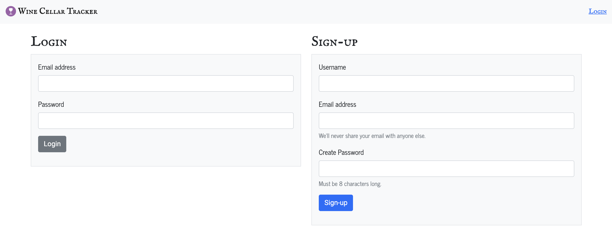

# Bottles DB - A Wine Cellar Tracker
--------------------

  ## Table of Contents
  1. [Team Members](#team)
  2. [About Project](#about)
  3. [Screenshot](#screenshot)
  4. [Technologies Used](#technologies)
  5. [User Criteria](#criteria)
  6. [Deployed Version](#deployment)
  7. [Questions](#questions)
  
--------------------

## Team

- Brian Tracy
- Justin Meredith
- Nikko Ganacias
- Daesang Ogle

--------------------

## About

Create a user profile that you will need to login into to gain access, email will be sent user to confirming user name / email.
Once you are allowed access, you are able to list your wine inventory to your profile
We are able to update bottles of wine, delete bottles, and change quantities.
Each bottle has specific inventory location

--------------------

## Screenshot

--------------------

## Technologies Used

* HTML
* CSS
* JavaScript
* MySQL
* Express.js
* Node Packages   
    - sequelize
    - util
    - handlebars
    - socket.io
    - nodemailer
    - bcrypt
--------------------

## Criteria

* Use Node.js and Express.js to create a RESTful API.
​
* Use Handlebars.js as the template engine.
​
* Use MySQL and the Sequelize ORM for the database.
​
* Have both GET and POST routes for retrieving and adding new data.
​
* Use at least one new library, package, or technology that we haven’t discussed.
​
* Have a folder structure that meets the MVC paradigm.
​
* Include authentication (express-session and cookies).
​
* Protect API keys and sensitive information with environment variables.
​
* Be deployed using Heroku (with data).
​
* Have a polished UI.
​
* Be responsive.
​
* Be interactive (i.e., accept and respond to user input).
​
* Meet good-quality coding standards (file structure, naming conventions, follows best practices for class/id naming conventions, indentation, quality comments, etc.).
​
* Have a professional README (with unique name, description, technologies used, screenshot, and link to deployed application)
​
* Elevator pitch: a one minute description of your application
​
* Concept: What is your user story? What was your motivation for development?
​
* Process: What were the technologies used? How were tasks and roles broken down and assigned? What challenges did you encounter? What were your successes?
​
* Directions for Future Development
​​
  * Application uses a Node.js and Express.js back end and uses both GET and POST routes for retrieving and adding new data.
​
  * Application has a folder structure that meets the MVC paradigm and uses Handlebars.js as the template engine.
​
  * Application is backed by a MySQL database with a Sequelize ORM and protects API keys and sensitive information with environment variables.
​
  * Application includes user authentication (express-session and cookies).
​
  * Application uses at least one new library, package, or technology not covered in class.
​
​*Application should be a unique and novel idea.
​
* Your group should clearly and concisely articulate your project idea.
​
​* Application deployed at live URL on Heroku and loads with no errors.
​
* Application GitHub URL submitted.
​
​* Repository has a unique name.
​
* Repository follows best practices for file structure and naming conventions.
​
* Repository follows best practices for class/id-naming conventions, indentation, quality comments, etc.
​
* Repository contains multiple descriptive commit messages.
​
* Repository contains quality README file with description, screenshot, and link to deployed application.
​
​* Application user experience is intuitive and easy to navigate.
​
* Application user interface style is clean and polished.
​
* Application is responsive.
​
* Your group should present using Powerpoint or a similar presentation software.
​
* Every group member should speak during the presentation.
​
* Your presentation should follow the [Project Presentation Template](https://docs.google.com/presentation/d/10QaO9KH8HtUXj__81ve0SZcpO5DbMbqqQr4iPpbwKks/edit?usp=sharing).
​
* There are no major disparities in the number of GitHub contributions between group members.
​
* The URL of the deployed application.
​
* The URL of the GitHub repository, with a unique name and a README describing the project.

--------------------

## Deployment

This project is deployed on Heroku. You may reach it by navigating to https://bottles-db.herokuapp.com/

The Github repository is available at https://github.com/JustinM099/wine-cellar-tracker

--------------------

## Questions

We hope you like the project! Please feel free to reach out to any of us at our Github profiles:

* Justin Meredith: https://github.com/JustinM099
* Brian Tracy: https://github.com/bravotango
* Daesang Ogle: https://github.com/deashawnogle
* Nikko Ganacias: https://github.com/neex18

Thank you!
